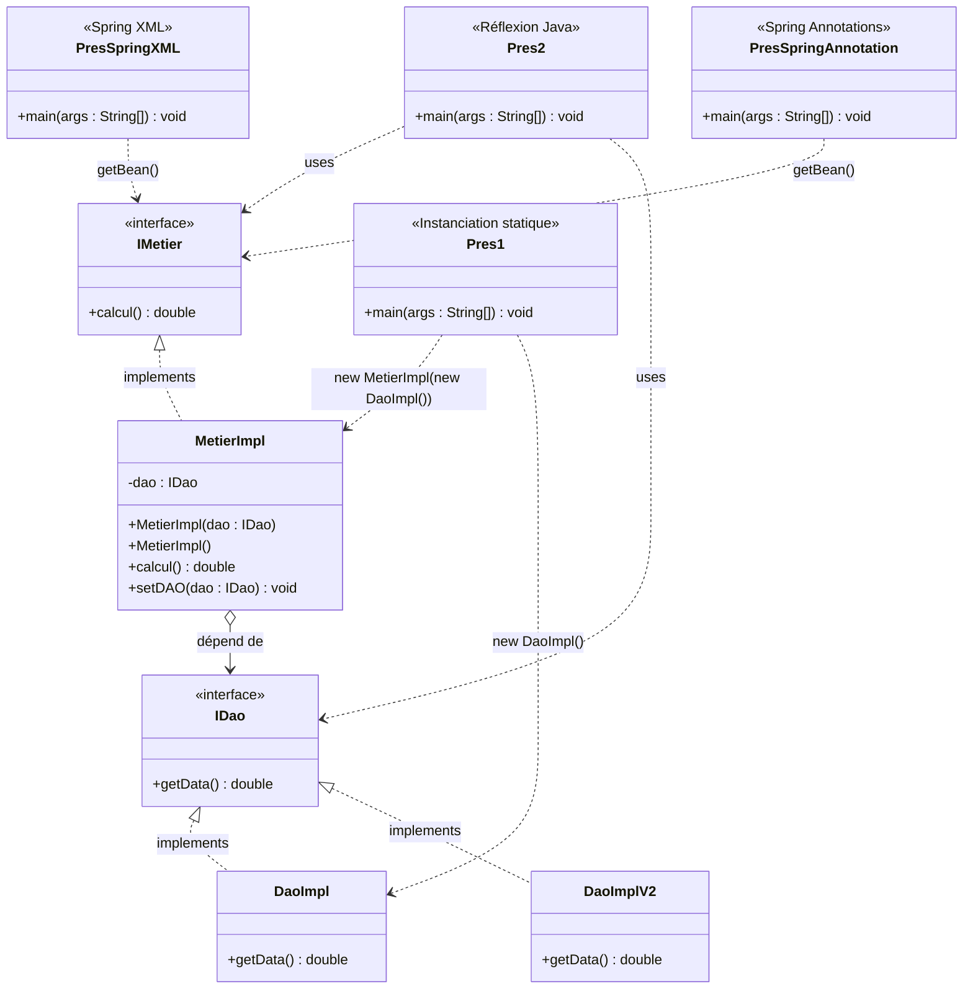

# 🧩 Injection de Dépendances & Inversion de Contrôle — Spring Framework

> Projet pédagogique illustrant les différentes approches d'**Inversion de Contrôle (IoC)** et d'**Injection de Dépendances (DI)** en Java — du couplage statique jusqu'à Spring Framework avec annotations.

---

## 📚 Table des matières

- [Contexte & Principes](#-contexte--principes)
- [Architecture en couches](#️-architecture-en-couches)
- [Diagramme de classes](#-diagramme-de-classes)
- [Approches implémentées](#-approches-implémentées)
- [Types d'injection de dépendances](#-types-dinjection-de-dépendances)
- [Comparatif des approches](#-comparatif-des-4-approches)
- [Structure des packages](#-structure-des-packages)
- [Technologies utilisées](#️-technologies-utilisées)
- [Lancer le projet](#-lancer-le-projet)

---

## 🎯 Contexte & Principes

### Qu'est-ce que le couplage fort ?

Dans une approche classique, la couche métier instancie directement ses dépendances :

```java
// ❌ Couplage fort — MetierImpl crée lui-même son DAO
public class MetierImpl {
    private DaoImpl dao = new DaoImpl(); // dépendance directe à l'implémentation
}
```

> **Problème** : si on veut changer `DaoImpl` par `DaoImplV2` (ex: passer d'une BDD à un Web Service), il faut **modifier et recompiler** le code métier.

---

### ✅ La solution : Inversion de Contrôle (IoC) + Injection de Dépendances (DI)

| Concept | Définition |
|--------|-----------|
| **IoC** | Inverser le contrôle : ce n'est plus la classe qui crée ses dépendances, c'est un **conteneur externe** |
| **DI** | Mécanisme concret de l'IoC : les dépendances sont **injectées** depuis l'extérieur |
| **Couplage faible** | Les classes dépendent d'**interfaces**, jamais d'implémentations concrètes |

> 💡 **Principe de Hollywood** : *"Don't call us, we'll call you"* — le framework prend le contrôle et fournit les objets dont vous avez besoin.

---

### Principe SOLID appliqué

Ce projet illustre notamment le **principe D** des SOLID :

> **Dependency Inversion Principle** : les modules de haut niveau ne doivent pas dépendre des modules de bas niveau. Les deux doivent dépendre d'**abstractions** (interfaces).

```
❌ MetierImpl  →  DaoImpl           (dépendance à une implémentation concrète)
✅ MetierImpl  →  IDao  ←  DaoImpl  (dépendance à une interface)
```

---

## 🏗️ Architecture en couches

Le projet suit une architecture **3 couches** :

```
┌─────────────────────────────────────────────────────┐
│              Couche Présentation                    │
│   Pres1 | Pres2 | PresSpringXML | PresSpringAnnot  │
│   (résout et injecte les dépendances)               │
├─────────────────────────────────────────────────────┤
│              Couche Métier                          │
│             IMetier  ←  MetierImpl                  │
│   (logique de calcul, dépend de IDao via interface) │
├─────────────────────────────────────────────────────┤
│           Couche Accès aux Données                  │
│       IDao  ←  DaoImpl  |  DaoImplV2                │
│   (Base de données ou Web Service)                  │
└─────────────────────────────────────────────────────┘
```

---

## 📊 Diagramme de classes



> `MetierImpl` ne connaît jamais `DaoImpl` directement — elle dépend uniquement de l'interface `IDao`. C'est le **conteneur** (Spring ou la couche présentation) qui résout et injecte l'implémentation concrète au moment de l'exécution.

---

## 🔄 Approches implémentées

### 1️⃣ Couplage statique — `Pres1.java`

La dépendance est résolue **manuellement dans le code**, à la compilation.

```java
MetierImpl metier = new MetierImpl(new DaoImpl());
System.out.println("Res= " + metier.calcul());
```

```
Pres1
  └── new MetierImpl( new DaoImpl() )
                           └── getData() → 41.0
                      └── calcul() → 41.0 * 43 / 3 = 587.67
```

| ✅ Avantage | ❌ Inconvénient |
|---|---|
| Simple, lisible | Changer de DAO = modifier + recompiler |
| Aucune dépendance externe | Couplage fort |

---

### 2️⃣ Injection dynamique par réflexion — `Pres2.java`

Les noms des classes sont lus depuis `config.txt`. L'instanciation se fait à l'exécution via la **Java Reflection API**, sans aucune recompilation.

**`config.txt`**
```
net.enset.dao.DaoImplV2
net.enset.metier.MetierImpl
```

```java
Scanner scanner = new Scanner(new File("config.txt"));

String daoClassName = scanner.nextLine();
Class cDao = Class.forName(daoClassName);
IDao dao = (IDao) cDao.newInstance();

String metierClassName = scanner.nextLine();
Class cMetier = Class.forName(metierClassName);
IMetier metier = (IMetier) cMetier.getConstructor(IDao.class).newInstance(dao);

System.out.println("RES= " + metier.calcul());
```

```
config.txt
  ├── net.enset.dao.DaoImplV2      → Class.forName() → IDao
  └── net.enset.metier.MetierImpl  → getConstructor(IDao.class).newInstance(dao) → IMetier
                                              └── calcul() exécuté
```

| ✅ Avantage | ❌ Inconvénient |
|---|---|
| Aucune recompilation | Verbeux, gestion d'exceptions complexe |
| Changer d'impl = modifier `config.txt` | Pas de validation à la compilation |

---

### 3️⃣ Spring — Configuration XML — `PresSpringXML.java`

Le conteneur Spring est déclaré dans `config.xml`. Spring instancie les beans et injecte les dépendances automatiquement.

**`config.xml`**
```xml
<?xml version="1.0" encoding="UTF-8"?>
<beans xmlns="http://www.springframework.org/schema/beans"
       xmlns:xsi="http://www.w3.org/2001/XMLSchema-instance"
       xsi:schemaLocation="http://www.springframework.org/schema/beans
           http://www.springframework.org/schema/beans/spring-beans.xsd">

    <!-- Déclaration du bean DAO -->
    <bean id="dao" class="net.enset.dao.DaoImpl"/>

    <!-- Injection par constructeur -->
    <bean id="metier" class="net.enset.metier.MetierImpl">
        <constructor-arg ref="dao"/>
    </bean>

    <!-- Alternative : Injection par setter -->
    <!--
    <bean id="metier" class="net.enset.metier.MetierImpl">
        <property name="dao" ref="dao"/>
    </bean>
    -->

</beans>
```

```java
ApplicationContext springContext =
    new ClassPathXmlApplicationContext("config.xml");
IMetier metier = springContext.getBean(IMetier.class);
System.out.println("RES= " + metier.calcul());
```

```
ClassPathXmlApplicationContext
  └── lit config.xml
       ├── crée bean DaoImpl    (id="dao")
       └── crée bean MetierImpl (id="metier")
            └── injecte DaoImpl via <constructor-arg ref="dao">
                     └── calcul() → résultat
```

| ✅ Avantage | ❌ Inconvénient |
|---|---|
| Aucune annotation dans les classes | Fichier XML verbeux |
| Configuration centralisée et externalisée | Moins pratique pour les gros projets |

---

### 4️⃣ Spring — Annotations — `PresSpringAnnotation.java`

Spring scanne automatiquement le package `net.enset` et résout les dépendances grâce aux annotations.

```java
ApplicationContext ctx =
    new AnnotationConfigApplicationContext("net.enset");
IMetier metier = ctx.getBean(IMetier.class);
System.out.println("RES= " + metier.calcul());
```

**Annotations utilisées :**

```java
@Component("d")                    // DaoImpl → bean Spring avec id "d"
public class DaoImpl implements IDao {
    public double getData() {
        System.out.println("Version Base de données");
        return 41.00;
    }
}

@Component("d2")                   // DaoImplV2 → bean Spring avec id "d2"
public class DaoImplV2 implements IDao {
    public double getData() {
        System.out.println("Version Web Service");
        return 23.00;
    }
}

@Component
public class MetierImpl implements IMetier {

    @Autowired @Qualifier("d")     // injecte spécifiquement le bean "d" (DaoImpl)
    private IDao dao;

    public MetierImpl(IDao dao) { this.dao = dao; }
    public MetierImpl() {}

    public double calcul() {
        double t = dao.getData();
        return t * 43 / 3;
    }
}
```

```
AnnotationConfigApplicationContext("net.enset")
  └── scan du package net.enset
       ├── @Component("d")   → DaoImpl
       ├── @Component("d2")  → DaoImplV2
       └── @Component        → MetierImpl
            └── @Autowired @Qualifier("d") → injecte DaoImpl
                     └── calcul() → résultat
```

| ✅ Avantage | ❌ Inconvénient |
|---|---|
| Approche moderne, concise | Annotations couplées au framework Spring |
| Détection automatique des beans | Moins visible qu'un XML centralisé |
| Standard dans les projets Spring Boot | — |

---

## 💉 Types d'injection de dépendances

Spring supporte **3 types d'injection** — tous illustrés dans ce projet :

### Type 1 — Injection par constructeur *(recommandée)*

```java
public MetierImpl(IDao dao) {
    this.dao = dao;
}
```
> ✅ Dépendance obligatoire. L'objet est toujours dans un état valide dès sa création.

---

### Type 2 — Injection par setter

```java
public void setDAO(IDao dao) {
    this.dao = dao;
}
```
> ✅ Dépendance optionnelle ou reconfigurable après création.

---

### Type 3 — Injection par attribut (annotation directe)

```java
@Autowired @Qualifier("d")
private IDao dao;
```
> ✅ Syntaxe la plus concise. ⚠️ Rend les tests unitaires plus difficiles (attribut privé).

---

## 📊 Comparatif des 4 approches

| Critère | Pres1 | Pres2 | Spring XML | Spring Annotations |
|---|:---:|:---:|:---:|:---:|
| Couplage | Fort | Faible | Faible | Faible |
| Recompilation si changement | ✅ | ❌ | ❌ | ❌ |
| Configuration externalisée | ❌ | ✅ `.txt` | ✅ `.xml` | ✅ annotations |
| Validation à la compilation | ✅ | ❌ | ❌ | ✅ |
| Production-ready | ❌ | ❌ | ✅ | ✅ |
| Lisibilité | ⭐⭐⭐ | ⭐⭐ | ⭐⭐⭐ | ⭐⭐⭐⭐ |

---

## 📦 Structure des packages

```
src/
└── main/
    ├── java/net/enset/
    │   ├── dao/
    │   │   ├── IDao.java           → Interface : contrat getData()
    │   │   ├── DaoImpl.java        → Implémentation BDD    @Component("d")
    │   │   └── DaoImplV2.java      → Implémentation WS     @Component("d2")
    │   ├── metier/
    │   │   ├── IMetier.java        → Interface : contrat calcul()
    │   │   └── MetierImpl.java     → Logique métier         @Component
    │   └── pres/
    │       ├── Pres1.java                → Instanciation statique
    │       ├── Pres2.java                → Réflexion Java (config.txt)
    │       ├── PresSpringXML.java        → Spring XML (config.xml)
    │       └── PresSpringAnnotation.java → Spring Annotations
    └── resources/
        └── config.xml              → Configuration Spring XML
```

---

## 🛠️ Technologies utilisées

- **Java 8+**
- **Spring Framework**
  - `spring-context` — Conteneur IoC
  - `ClassPathXmlApplicationContext` — Chargement XML
  - `AnnotationConfigApplicationContext` — Scan annotations
  - `@Component`, `@Autowired`, `@Qualifier`
- **Java Reflection API** — `Class.forName()`, `getConstructor()`, `newInstance()`
- **Maven** — Gestion des dépendances

**`pom.xml` — dépendance Spring :**
```xml
<dependency>
    <groupId>org.springframework</groupId>
    <artifactId>spring-context</artifactId>
    <version>5.3.27</version>
</dependency>
```

---

## ▶️ Lancer le projet

### Prérequis
- Java 8+
- Maven 3+

### Build

```bash
mvn clean install
```

### Exécution

```bash
# Approche 1 : Instanciation statique
mvn exec:java -Dexec.mainClass="net.enset.pres.Pres1"

# Approche 2 : Réflexion Java (config.txt doit être à la racine)
mvn exec:java -Dexec.mainClass="net.enset.pres.Pres2"

# Approche 3 : Spring XML (config.xml dans src/main/resources)
mvn exec:java -Dexec.mainClass="net.enset.pres.PresSpringXML"

# Approche 4 : Spring Annotations
mvn exec:java -Dexec.mainClass="net.enset.pres.PresSpringAnnotation"
```

### Résultats attendus

```
# Avec DaoImpl (Base de données)
Version Base de données
RES= 587.6666666666666

# Avec DaoImplV2 (Web Service)
Version Web Service
RES= 329.6666666666667
```

---

> 📖 Projet réalisé dans le cadre du cours **Architecture JEE & Spring** — ENSET Mohammedia
